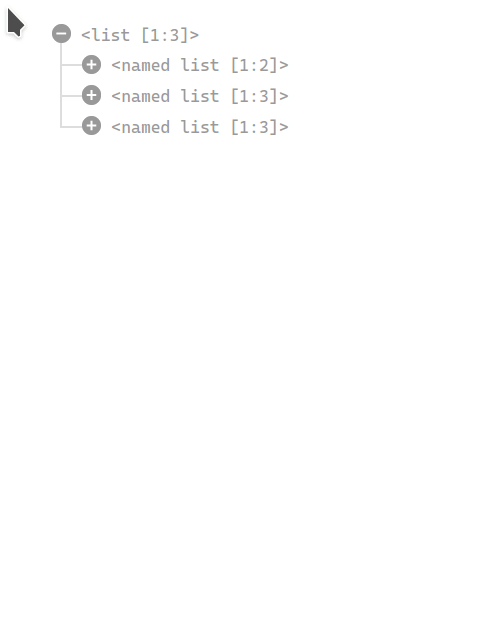

<!-- README.md is generated from README.Rmd. Please edit that file -->

```{r, include = FALSE}
knitr::opts_chunk$set(
  collapse = TRUE,
  comment = "#>",
  fig.path = "man/figures/README-",
  out.width = "100%"
)
```

# listviewerlite

<!-- badges: start -->
<!-- badges: end -->

listviewerlite provides a single function `listview()`, which creates a collapsible tree view of R lists using only HTML and CSS, without the need for JavaScript.

## Installation

You can install the development version of listviewerlite from [GitHub](https://github.com/) with:

``` r
# install.packages("devtools")
devtools::install_github("long39ng/listviewerlite")
```

## Example

``` r
library(listviewerlite)

x <- list(
  list(id = "a", val = 2),
  list(
    id = "b",
    val = 1,
    children = list(
      list(id = "b1", val = 2.5),
      list(
        id = "b2",
        val = 8,
        children = list(
          list(id = "b21", val = 4)
        )
      )
    )
  ),
  list(
    id = "c",
    val = 8,
    children = list(
      list(id = "c1"),
      list(id = "c2", val = 1)
    )
  )
)

listview(x)
```

{width=480px}

## Acknowledgements

This package is inspired by [{listviewer}](https://github.com/timelyportfolio/listviewer), which wraps the JavaScript libraries [jsoneditor](https://github.com/josdejong/jsoneditor) and [react-json-view](https://github.com/mac-s-g/react-json-view).

The implementation of the `listview()` function is inspired by `utils::str()` and `lobstr::tree()`.

The custom CSS properties for the collapsible tree view are copied and modified from the [blog post by Kate Rose Morley](https://iamkate.com/code/tree-views/).
